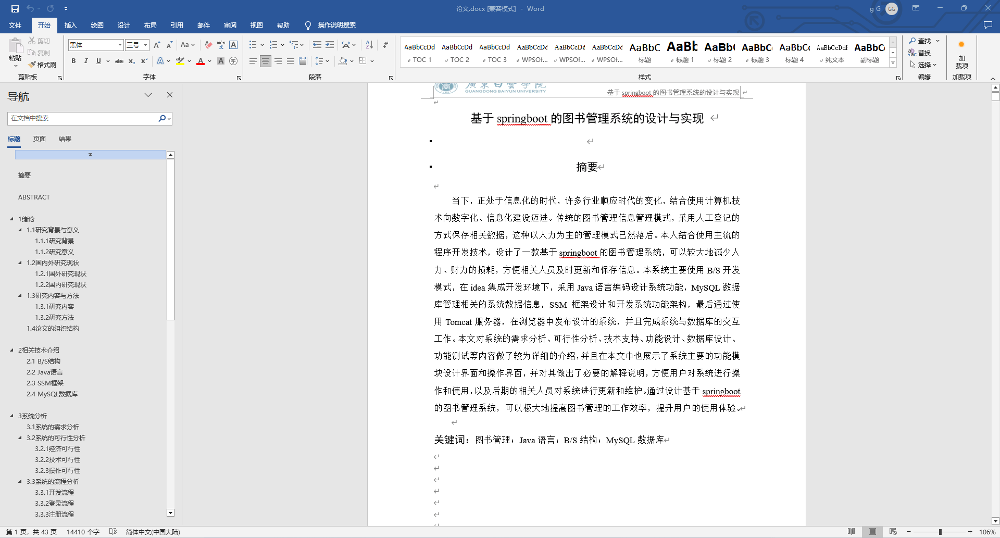
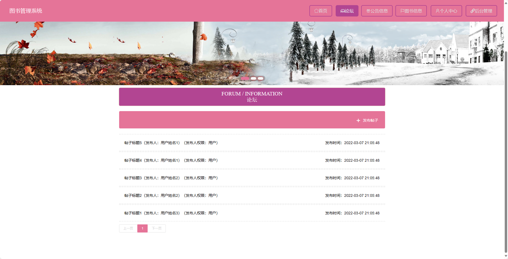
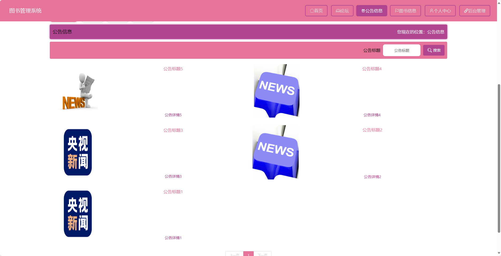
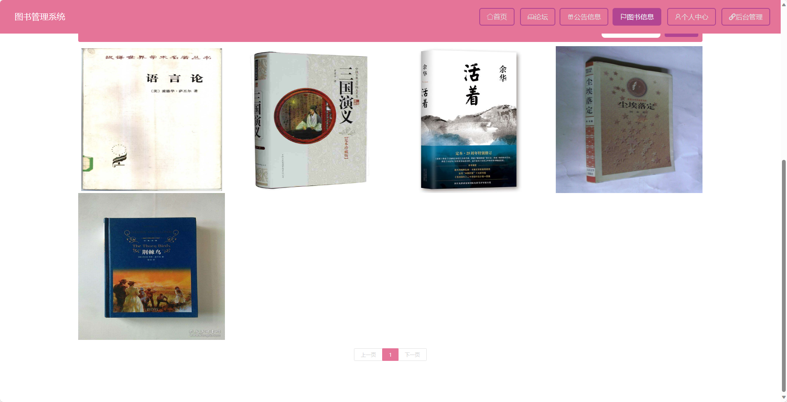
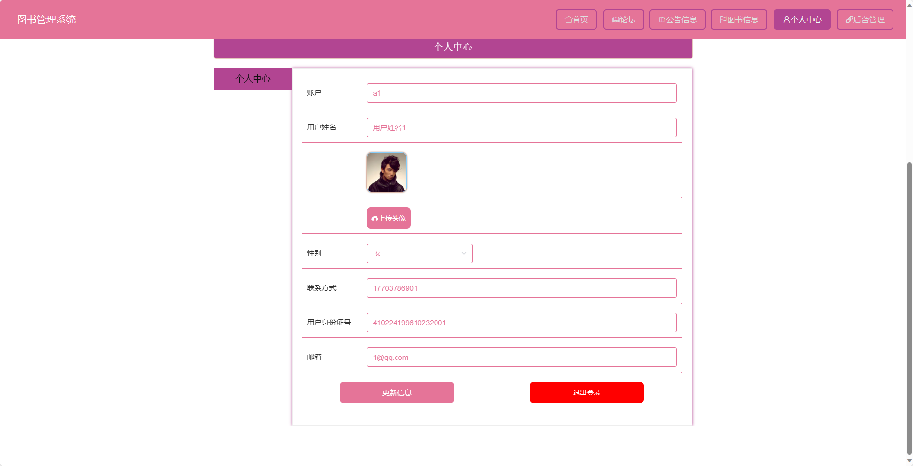
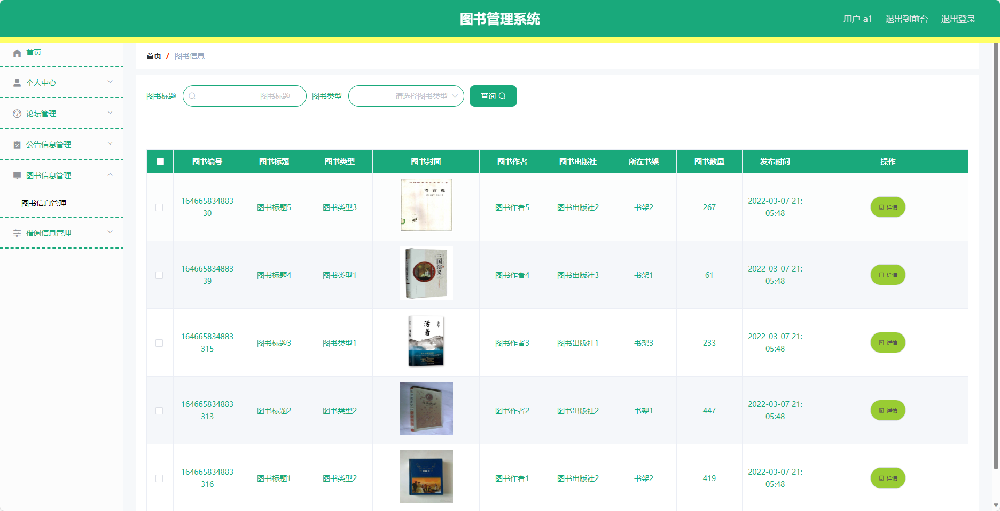
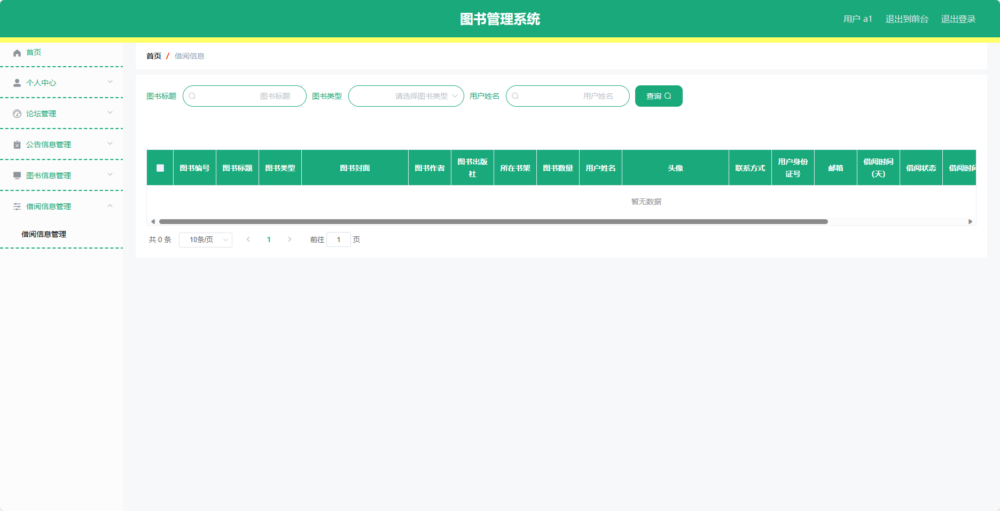
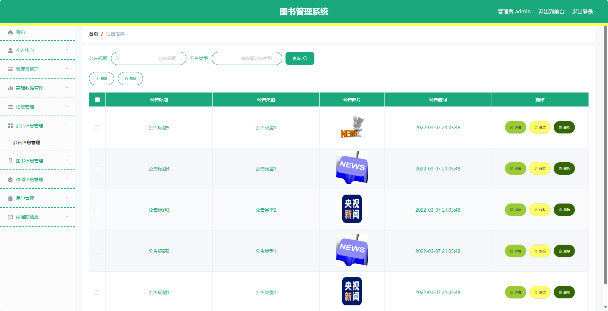
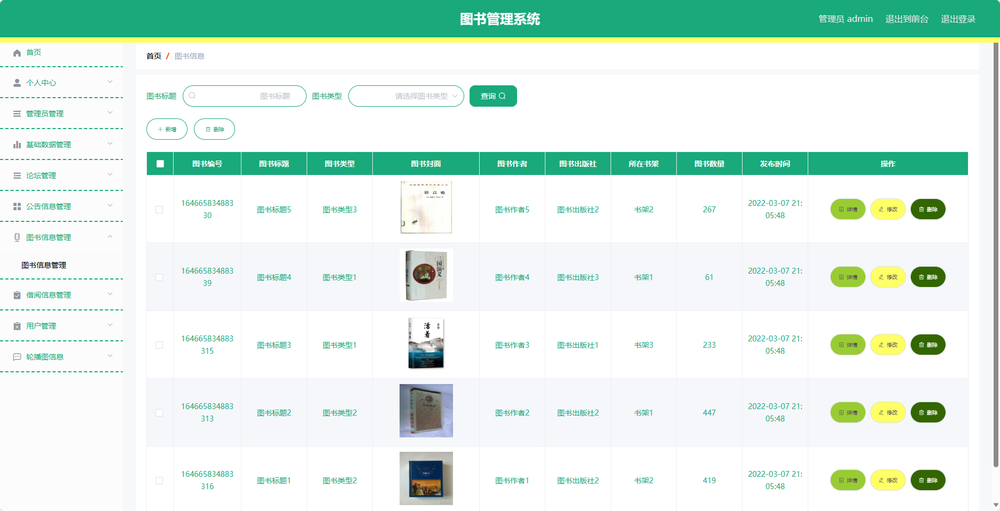

## 基于SpringBoot的图书管理系统(程序+报告)

- <b>完整代码获取地址：从戎源码网 ([https://armycodes.com/](https://armycodes.com/))</b>
- <b>技术探讨、资料分享，请加QQ群：692619798</b> 
- <b>作者微信：19941326836  QQ：952045282</b> 
- <b>承接计算机毕业设计、Java毕业设计、Python毕业设计、深度学习、机器学习</b>
- <b>选题+开题报告+任务书+程序定制+安装调试+论文+答辩ppt 一条龙服务</b>
- <b>所有选题地址 ([https://github.com/YuLin-Coder/AllProjectCatalog](https://github.com/YuLin-Coder/AllProjectCatalog)) </b>

## 项目介绍
基于SpringBoot的图书管理系统，系统包含两种角色：管理员、用户,系统分为前台和后台两大模块，主要功能如下。

### 【管理员】:
- 个人中心：管理个人信息。
- 管理员管理：管理系统管理员的基本信息。
- 基础数据管理：管理系统的基础数据信息。
- 图书出版社管理：管理图书出版社的基本信息。
- 公告类型管理：管理系统公告的分类信息。
- 所在书架管理：管理图书所在书架的信息。
- 图书类型管理：管理系统图书的分类信息。
- 论坛管理：管理论坛帖子及回复等信息。
- 公告信息管理：管理系统公告信息。
- 图书信息管理：管理所有的图书信息。
- 借阅信息管理：管理用户的借阅信息。
- 用户管理：管理系统用户的基本信息。
- 轮播图信息：管理系统首页轮播图的信息。

### 【用户】:
- 个人中心：管理个人信息。
- 论坛管理：管理论坛帖子及回复等信息。
- 公告信息管理：管理系统公告信息。
- 图书信息管理：管理所有的图书信息。
- 借阅信息管理：管理用户的借阅信息。
    
### 【前台】:
- 首页：展示系统推荐、热门图书等信息。
- 论坛：提供用户交流讨论的平台。
- 公告信息：展示系统公告以及最新动态。
- 图书信息：展示系统所有图书的信息。
- 个人中心：提供用户管理个人信息、借阅信息等的入口。

## 项目技术
- 编程语言：Java
- 数据库：MySQL
- 项目管理工具：Maven
- 前端技术：HTML、CSS、JavaScript、Jquery、Vue
- 后端技术：Spring、SpringMVC、MyBatis

## 运行环境
- JDK版本：JDK1.8及以上
- 开发工具：IDEA、Ecplise、Myecplise都可以
- 数据库: MySQL5.7及以上
- Maven：maven3.0及以上
- Node：14.14.0及以上

## 运行截图

